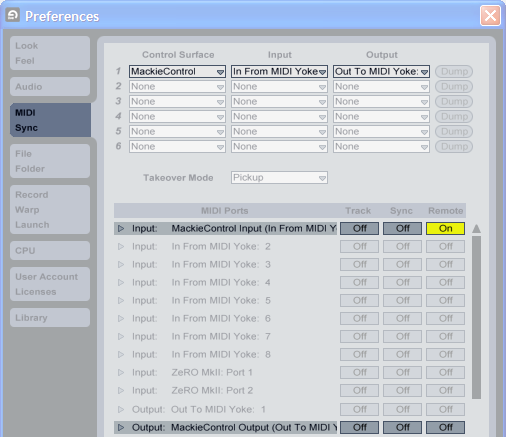
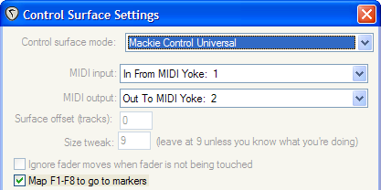
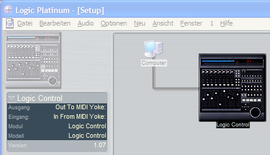
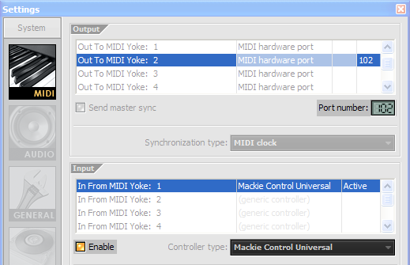

Mackie Control
==============

**Mackie Control** (abbreviated to MCU), its predecessor **Logic
Control** and their respective extension units (**XT**) are control
surfaces that use a proprietary MIDI protocol to control digital audio
workstations (DAWs), especially their mixing sections. However, these
control surfaces have two drawbacks: they are definitely not cheap and
require quite a bit of space. If these are no restrictions to you, by
all means go and try them.

If, on the other hand, you have a certain lack of money or available
space (or you have a controller that is simply too good to be exchanged
for an MCU), you might have found just the application you need. It
might not support your MIDI hardware controller yet, but if you know a
bit of **Python** (or a programmer who does) it should be pretty easy to
change that.

Installation
============

Download and install the latest version of `Python
3.9 <http://www.python.org/>`_ on your computer.

Please also download and install these libraries:

* `PySide2 <http://www.pyside.org//>`_ (version 5.15.2 or above)

* `pygame <http://www.pygame.org/>`_ (version 2.0.0 or above; please
  note that pygame's MIDI implementation is still in its infancy and
  may thus occasionally crash **Python MCU**)

You'll also need virtual MIDI ports or cables to connect **Python MCU**
to your DAW and hardware controller. I have successfully used
`loopMIDI <https://www.tobias-erichsen.de/software/loopmidi.html>`_
or **MidiYoke NT** (Microsoft Windows) and **JACK** (GNU/Linux),
but others may work just as well.

When you're done, open the directory with your file manager and run the
application by double-clicking on the file ``python_mcu.py``. To get rid of the annoying
console window on Microsoft Windows, try double-clicking on ``python_mcu.pyw``, instead.

Running Python MCU
==================

Here's a word of warning. Although I have taken precautionary steps,
there is some inherent risk that your controller might be destroyed by
running **Python MCU** (mine was, once, when I was trying to change a
lot of code at once). So please read the :ref:`License`
before you run **Python MCU**, especially the sections *Disclaimer of
Warranty* and *Limitation of Liability*.

That being said, here's how to set up **Python MCU**...

.. container:: center

   .. image:: include/images/python_mcu.png
      :alt: PythonMCU

Emulation:
   Choose between "Logic Control" and "Mackie Control". The latter
   should be fine for most current DAWs. The extension units "Logic
   Control XT" and "Mackie Control XT" have been added for completeness,
   but I don't think you'll ever need them.

Connection:
   Determines how **Python MCU** connects to your DAW. If you're having
   trouble with connecting, try changing this setting.

   "Challenge / Response" forces **Python MCU** to register with your
   DAW (which will only work if your DAW supports this), whereas "Wait
   for MIDI data" simply waits for some data on the MIDI input port.
   "Assume successful connection" has been added for testing purposes –
   this setting assumes the presence of a Mackie-Control-aware DAW
   without checking.

MIDI In/Out:
   The virtual MIDI cables that connect **Python MCU** to your DAW. I
   freely admit that it's not easy to understand the routing of virtual
   MIDI cables, so I recommend using the first cable to send data from
   **Python MCU** to your DAW and the second one to send data from your
   DAW to **Python MCU**:

   .. image:: include/images/virtual_midi_cables.png
      :alt: Virtual MIDI Cables

   This way, you can simply look at the screen-shots in this document
   and set up **Python MCU** and your DAW accordingly.

Controller:
   Select your hardware controller and the MIDI ports it provides or is
   connected to. There is a text field directly below which might give
   you some hints on connecting your controller to **Python MCU**.

Hardware controllers
====================

For the controller assignments of your hardware, please have a look at .

Novation ZeRO SL MkII
---------------------

This adaption makes good use of preset #32 (Ableton Live Automap), so
you either have to select this preset whenever you want to use **Python
MCU** or set it up as your default preset.

Whenever you press the **Automap** button, **Python MCU** temporarily
stops to let you do your thing in **Automap**. When you're done, simply
press the **Automap** button again.

You may also connect a sustain pedal to the "control pedal" input and
use it to alternately start and stop playback in your DAW. If it doesn't
work, you'll have to change the preset: Edit >
Sustain Pedal > Ports: **ComnPORT** and MidiChan:
**ComnCHAN.** Don't forget to save your changes...

Digital Audio Workstations
==========================

Ableton Live
------------

Emulation:
   Mackie Control (Wait for MIDI data)

Cockos Reaper
-------------

Emulation:
   Mackie Control (Wait for MIDI data)

Emagic Logic
------------

Emulation:
   Logic Control (Challenge / Response)

Image-Line FL Studio
--------------------

Emulation:
   Mackie Control (Wait for MIDI data)

Tested configurations
=====================

Hardware controllers
--------------------

.. container:: compactitem

   Novation ZeRO SL MkII

Microsoft Windows XP
--------------------

.. container:: compactitem

   Ableton Live 8

   Cockos Reaper 4

   Emagic Logic Platinum 5

   Image-Line FL Studio Pro 10

Apple Mac
---------

I haven't got a Mac, but things should work just as well. Please report
working configurations to me. Thanks!

GNU/Linux
---------

.. container:: compactitem

   ardour 2 (*skipped a lot of commands, though*)

Extending Python MCU
====================

**Python MCU** consists of three parts:

-  the **MackieHostControl** class communicates with a connected
   sequencer using the Mackie Control protocol, translating the raw
   protocol to something much easier to read and use

-  the generalised **MidiControllerTemplate** class and its more
   specific relatives handle all the details of sending data to and
   receiving data from your hardware controller, again translating raw
   protocols to something easier to read and use

-  finally, the **McuInterconnector** class connects the
   **MackieHostControl** and **MidiControllerTemplate** classes (and
   thus your DAW and hardware controller) with each other

This modular design means that the application happily works away with
the irrelevant implementation details being effectively hidden from you.
As long as you adhere to the internal protocol, you may easily add your
own controller to **Python MCU** by deriving a class from
**MidiControllerTemplate**.

If all this means nothing to you, go find yourself a Python programmer
(or learn Python yourself, it's rather easy and a lot of fun!). As long
as you know the relevant MIDI implementation of your hardware controller
and worked out a suitable layout of its buttons and controllers, hooking
into **Python MCU** is pretty simple. If you don't believe me, just have
a look into the directory.
